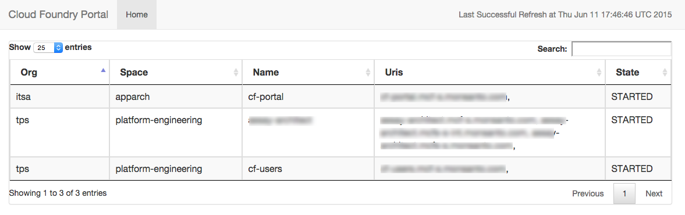
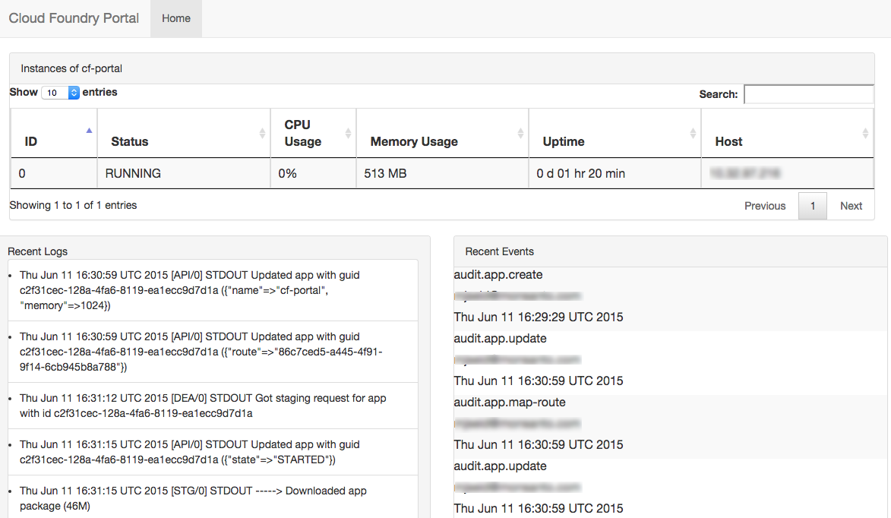

#Cloud Foundry Portal

The CloudFoundry Portal UI provides basic CF application troubleshooting details useful to a LV1 support team.  Although other CF UI's exist ([admin-ui](https://github.com/cloudfoundry-incubator/admin-ui)) they require user authentication and management due to their administratative read/write capabilites.  CF portal is meant to be used in conjunction with these UI's to provide read only summary statistics eliminating the need to manage Org and Space accounting and providing the right level of detail for a novice CF user.

See the [Using the Portal UI](#using) section for more information on using it and for sample screen shots.

## Setup

### Creating the Uaa User
Since the application talks to the cloud controller to get its information, it needs a admin level account to work correctly.  You can either use the default admin account, or create one specifically for this application.  If you choose the later option, install the [uaac cli](https://github.com/cloudfoundry/cf-uaac) and create the account as follows:
```
uaac target https://uaa.yourcompany.com
uaac token client get admin
uaac client update admin --authorities "clients.write clients.read uaa.admin scim.read scim.write"
uaac token delete
uaac token client get admin
uaac user add --emails cfapi@fake.com -p password
	**specify username as “cfapi” when prompted
uaac member add cloud_controller.admin cfapi
```

### User Configuration
To configure the application for your enviornment, set the following enviornment variables to reflect the username and password of the admin account you created as well as the api url for your cloudfoundry installation
```
  USER: "cfapi"
  PASSWORD: "password"
  URL: "https://api.company.com"
```

### Update Frequency
The application periodically pulls the cf api to enumerate the information it needs and stores it in a local H2 database.  This suffices for our use case since there is no information which cannot be easily re-created with an application restart.  Calls to the cf-portal UI will hit the local database, and the home page will show the last successfull db refresh in the top right hand corner.

The default polling interval is 5 minutes, which can be configured by editing the following line in app/Global.scala
```
    Akka.system(app).scheduler.schedule(5 minutes, 5 minutes)(updateActor ! "update db")
```

## Deploying the App
To run this app, simply clone the repository, cd into it, and run the following two commands to deploy it to CF.
```
sbt dist
cf push myapp -p target/universal/cf-portal-*.zip
```

## <a name="using"></a> Using the Portal UI
### Home Page

The home page shows a list of all applications deployed to the cloud foundry enviornment along with some useful information such as:

1.  Org
2.  Space
3.  Application name
4.  Application routes
5.  Application state (up/down)

Each column is sortable, and content can easily be found by using the search bar.

### Application Detail Page

Clicking on any row on the home page takes you to an page with more details for that specific application.  You can find information for each application instance such as:

1.  Application instance id
2.  Application instance status (up/down)
3.  CPU usage snapshot
4.  Memory usage snapshot
5.  Uptime 
6.  IP of the DEA the application instance is running on

You will also see a list of recent (<= 1 hour) logs and events for the application.

## Rest API
For programatic access, the following rest endpoints are exposed:

1.  /rest/apps - json output of information captured on the homepage
2.  /rest/apps/:name - json output of information for a specific app
3.  /rest/apps/:name/events - json output of events for a specific app
4.  /rest/apps/:name/logs - json output of logs for a specific app

